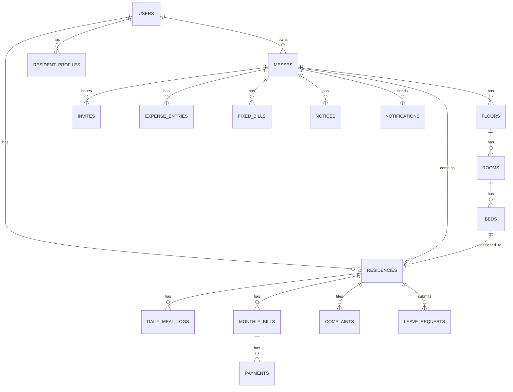

# Mess Management Platform — Complete Build Guide (v1.0)

> এই ডকুমেন্টটি একটি AI coding agent-কে দেওয়ার জন্য তৈরি। এতে product concept, tech stack, database schema, user flows, API contract এবং security plan — সবকিছু একসাথে আছে। v1.0 scope অনুযায়ী (marketplace ছাড়া, core mess management)।

---

## PART 1 — Product Concept

### What Is This Product?

This is a full-stack platform designed specifically for the shared housing ("mess") ecosystem in Bangladesh. A "mess" is a shared residential arrangement — typically a rented apartment where a group of people (usually students or young professionals) live together, pool money for groceries and utilities, cook and eat together, and split all costs. A "mess manager" is a resident or owner who handles the money, coordinates meals, and manages member intake.

Right now, this is managed manually — paper notebooks, WhatsApp groups, personal trust. This creates disputes over meal counts, unclear expenses, unfair bill splits, and no accountability. This platform digitizes the entire operation.

**v1.0 scope is Core Mess Management ONLY** — no public marketplace, no online payment gateway. Those are v1.5+ features. v1.0 is completely free (no monetization, no subscription/billing tables needed).

### Who Are the Users?

All users share a single global account — one person can be Owner of one mess and a Resident of another.

- **Owner** — Created the mess. Full control, can delete the mess, assign Managers.
- **Manager** — Delegated by Owner (or is the Owner) to run day-to-day operations: records expenses, manages meals, generates bills, handles residents.
- **Resident** — Lives in the mess. Toggles own meals daily, views own bill, submits complaints, requests leave.

### Core Product Logic

**Meal System:** Each resident marks breakfast/lunch/dinner ON or OFF daily, before a manager-defined cutoff time (after which it auto-locks). Manager logs daily grocery cost. The system computes: `daily_per_meal_rate = daily_grocery_cost / total_meals_eaten_that_day_by_all_residents`. Each resident's running meal cost = sum of `(meals_they_ate_on_a_day × that_day's_per_meal_rate)` across all days in the billing cycle. A resident can submit a vacation date-range, which auto-pauses their meal counting during that period. Guest meals can be tagged against a resident's own account.

**Finance System:** Beyond meals, there are fixed shared costs (rent, WiFi, electricity, house-help salary) split among residents — either equally or prorated by days-present-in-month (important for mid-month joiners/leavers). At month-end, the system auto-generates a full invoice per resident: meal cost breakdown, fixed bill share, previous dues, total payable. No online payment is processed in v1 — the system only records that a payment was made (manager marks it as paid, cash changes hands physically). Debt between residents (e.g., someone paid a bill on others' behalf) is settled using a minimum-transaction algorithm, but this is a v1.5 nice-to-have if time allows — not required for MVP.

**Resident Lifecycle:** Applicant (invited via link/QR, no public marketplace in v1) → Active Resident → Alumni (after leave + clearance). On leave, the system calculates final dues, generates a clearance record, deducts outstanding dues from security deposit.

**Security/Verification:** Each resident profile stores NID info, current institution/workplace, blood group, emergency contact — visible only to that mess's Owner/Manager.

### v1.0 Feature List (Final — 22 Features)

1. User Authentication (Register/Login/Logout, role-aware)
2. Global User Account (one login, multiple mess memberships)
3. Create & Manage Mess (Owner)
4. Floor → Room → Bed Mapping
5. Bed Status (Empty/Booked/Occupied)
6. Resident Onboarding (invite via link/QR — no public marketplace)
7. Resident Profile (NID, profession, blood group, emergency contact)
8. Meal ON/OFF Toggle (daily, per meal-type, with cutoff lock)
9. Vacation Mode (auto-pause meals for a date range)
10. Guest Meal Tagging
11. Live Meal Rate Display
12. Market/Bazar Expense Ledger (with receipt photo upload — manual entry, no AI scanning in v1)
13. Fixed Bill Entry & Split (equal or prorated)
14. Monthly Auto Invoice Generation (PDF)
15. Payment History (manually marked as paid/due — no gateway)
16. Notice Board
17. Complaint Management
18. Smart Leave & Clearance (final bill + deposit deduction)
19. Dashboard & Basic Reports (Owner/Manager view)
20. Role & Permission System (Owner/Manager/Resident)
21. Notifications (in-app + push)
22. Auto Bed Assignment (when invite is accepted)

**Explicitly OUT of v1.0 scope:** public vacancy marketplace, smart filters/map search, lifestyle compatibility matching, in-app chat, visit scheduling, online payment gateway (bKash/Nagad), AI receipt scanner, trust score/reviews, visitor & parcel QR pass, digital agreements, AI notice writer, budget prediction, analytics dashboards.

---

## PART 2 — Tech Stack & Architecture

### Architecture: API-First, Separate Clients

```
┌─────────────────────────────────────────────┐
│              Users                            │
└──────────┬──────────────────┬─────────────────┘
           │                  │
    ┌──────▼──────┐    ┌──────▼──────┐
    │  Next.js 15 │    │ Expo (RN)   │
    │  (Web App)  │    │  (Mobile)   │
    └──────┬──────┘    └──────┬──────┘
           │                  │
           └────────┬─────────┘
                REST API + WebSocket
           ┌────────▼─────────┐
           │   Laravel 11     │
           │   (Backend API)  │
           └────────┬─────────┘
                     │
        ┌────────────┼────────────┐
   ┌────▼───┐   ┌────▼───┐   ┌────▼───┐
   │Postgres│   │ Redis  │   │  R2    │
   │  (DB)  │   │(Cache/ │   │(Files) │
   │        │   │ Queue) │   │        │
   └────────┘   └────────┘   └────────┘
```

### Stack Summary

| Layer | Choice | Notes |
|---|---|---|
| Backend | Laravel 13 (PHP 8.5) | Service Layer + Repository pattern. API versioned `/api/v1/`. Latest stable major as of build start — no legacy constraints, so target current versions directly. |
| Web | Next.js 16.2 (App Router) + TypeScript | Dashboard is CSR; no public marketplace yet so SSR need is low in v1 — still use Next.js for future-proofing. Turbopack is default. Pin to 16.2 (Active LTS) rather than the newest 16.3 point release until it stabilizes. |
| Mobile | Expo (React Native) + TypeScript | Expo Router, EAS Build, OTA updates, push notifications. Use the latest Expo SDK compatible with the React Native version Expo currently ships. |
| Database | PostgreSQL | Managed via Laravel migrations only — never manual schema edits. |
| Cache/Queue | Redis + Laravel Horizon | Background jobs: PDF generation, notification dispatch, monthly bill cron. |
| Real-time | Laravel Reverb (WebSocket) | Live meal rate updates, instant notifications. |
| File Storage | Cloudflare R2 (S3-compatible) | Room photos, receipt photos, generated PDF invoices. |
| Auth | Laravel Sanctum | Token-based, works identically for web and mobile. |
| Containerization | Docker + Docker Compose | Host-independent — works on aaPanel VPS, AWS, Azure, anywhere. |
| API Docs | L5-Swagger (OpenAPI) | Auto-generated from route annotations. |

### Non-Negotiable Architecture Rules (for reliability)

1. **Service Layer Pattern** — Controllers only handle request/response. All business logic (meal rate calc, bill generation, prorated split) lives in `app/Services/`.
2. **Repository Pattern** — All DB queries go through repositories, not directly in controllers or services.
3. **API Versioning** — All routes under `/api/v1/...` from day one, so mobile app never breaks on backend updates.
4. **Every DB change is a migration** — no manual `ALTER TABLE`, ever. Migrations are committed to git.
5. **TypeScript strict mode** on both Next.js and Expo.
6. **No business logic duplicated between web and mobile** — both are thin clients calling the same API.

---

## PART 3 — Database Schema (PostgreSQL)

### Entity Relationship Overview



### Tables

#### `users`
Global account, not tied to a single mess.

| Column | Type | Notes |
|---|---|---|
| id | uuid, PK | |
| name | varchar(120) | |
| email | varchar(150), unique | |
| phone | varchar(20), unique | Bangladesh number format |
| password | varchar, hashed | |
| avatar_url | varchar, nullable | R2 path |
| email_verified_at | timestamp, nullable | |
| phone_verified_at | timestamp, nullable | |
| created_at, updated_at | timestamp | |

#### `messes`
| Column | Type | Notes |
|---|---|---|
| id | uuid, PK | |
| owner_id | uuid, FK → users.id | |
| name | varchar(150) | |
| address | text | |
| city | varchar(80) | |
| gender_policy | enum('male','female','mixed') | |
| meal_cutoff_breakfast | time | e.g. 07:00 |
| meal_cutoff_lunch | time | e.g. 11:00 |
| meal_cutoff_dinner | time | e.g. 18:00 |
| bill_split_default | enum('equal','prorated') | default fixed-bill split method |
| status | enum('active','archived') | |
| created_at, updated_at | timestamp | |

#### `floors`
| Column | Type | Notes |
|---|---|---|
| id | uuid, PK | |
| mess_id | uuid, FK → messes.id | |
| name | varchar(50) | e.g. "2nd Floor" |
| sort_order | int | |

#### `rooms`
| Column | Type | Notes |
|---|---|---|
| id | uuid, PK | |
| floor_id | uuid, FK → floors.id | |
| name | varchar(50) | e.g. "Room 3" |
| capacity | int | total beds in room |

#### `beds`
| Column | Type | Notes |
|---|---|---|
| id | uuid, PK | |
| room_id | uuid, FK → rooms.id | |
| label | varchar(20) | e.g. "Bed A" |
| status | enum('empty','occupied') | derived but cached for fast queries |

#### `residencies`
The join between a User and a Mess for a specific time period — this IS the "membership" record.

| Column | Type | Notes |
|---|---|---|
| id | uuid, PK | |
| user_id | uuid, FK → users.id | |
| mess_id | uuid, FK → messes.id | |
| bed_id | uuid, FK → beds.id, nullable | null until assigned |
| role | enum('owner','manager','resident') | |
| status | enum('invited','active','on_leave','left') | |
| joined_at | date, nullable | |
| left_at | date, nullable | |
| security_deposit_amount | decimal(10,2), default 0 | |
| created_at, updated_at | timestamp | |

> A user can have multiple `residencies` rows across different messes — this is how the "one account, many messes" requirement is satisfied.

#### `resident_profiles`
Sensitive verification data — one-to-one with `residencies` (not `users`, since NID etc. could theoretically differ per submission, but practically one-to-one with user is also fine — modeled here per-residency for clean data scoping per mess).

| Column | Type | Notes |
|---|---|---|
| id | uuid, PK | |
| residency_id | uuid, FK → residencies.id | |
| nid_number | varchar(30), nullable | |
| nid_photo_url | varchar, nullable | R2 path |
| profession_or_institution | varchar(150) | |
| blood_group | varchar(5), nullable | |
| emergency_contact_name | varchar(100) | |
| emergency_contact_phone | varchar(20) | |
| created_at, updated_at | timestamp | |

#### `invites`
Replaces "public marketplace application" in v1 — Manager generates a link/QR, applicant fills a short form, Manager approves → becomes `residency`.

| Column | Type | Notes |
|---|---|---|
| id | uuid, PK | |
| mess_id | uuid, FK → messes.id | |
| bed_id | uuid, FK → beds.id, nullable | target bed, if pre-selected |
| code | varchar(20), unique | short invite code for QR/link |
| status | enum('pending','accepted','expired','revoked') | |
| expires_at | timestamp | |
| created_by | uuid, FK → users.id | |
| accepted_by_user_id | uuid, FK → users.id, nullable | |
| created_at, updated_at | timestamp | |

#### `daily_meal_logs`
The core operational table — one row per resident per date per meal-type.

| Column | Type | Notes |
|---|---|---|
| id | uuid, PK | |
| residency_id | uuid, FK → residencies.id | |
| date | date | |
| meal_type | enum('breakfast','lunch','dinner') | |
| is_on | boolean | |
| is_guest_meal | boolean, default false | |
| guest_count | int, default 0 | extra guest meals tagged by this resident |
| locked_at | timestamp, nullable | set when cutoff passes |
| created_at, updated_at | timestamp | |

> Unique constraint on `(residency_id, date, meal_type)`.

#### `vacation_requests`
| Column | Type | Notes |
|---|---|---|
| id | uuid, PK | |
| residency_id | uuid, FK → residencies.id | |
| start_date | date | |
| end_date | date | |
| reason | varchar(200), nullable | |
| status | enum('pending','approved','rejected') | |
| created_at, updated_at | timestamp | |

#### `expense_entries`
Market/bazar ledger — feeds meal rate calculation.

| Column | Type | Notes |
|---|---|---|
| id | uuid, PK | |
| mess_id | uuid, FK → messes.id | |
| date | date | |
| amount | decimal(10,2) | |
| description | varchar(200) | |
| receipt_photo_url | varchar, nullable | R2 path |
| entered_by | uuid, FK → users.id | |
| created_at, updated_at | timestamp | |

#### `fixed_bills`
Rent, WiFi, electricity, house-help — recurring or one-off shared costs.

| Column | Type | Notes |
|---|---|---|
| id | uuid, PK | |
| mess_id | uuid, FK → messes.id | |
| title | varchar(100) | e.g. "Electricity - Sept" |
| amount | decimal(10,2) | |
| billing_month | varchar(7) | format "YYYY-MM" |
| split_method | enum('equal','prorated') | overrides mess default if set |
| created_at, updated_at | timestamp | |

#### `monthly_bills`
Auto-generated final invoice per resident per month — computed and stored (not recalculated on every read).

| Column | Type | Notes |
|---|---|---|
| id | uuid, PK | |
| residency_id | uuid, FK → residencies.id | |
| billing_month | varchar(7) | "YYYY-MM" |
| meal_cost_total | decimal(10,2) | |
| fixed_bill_share_total | decimal(10,2) | |
| previous_due | decimal(10,2), default 0 | |
| total_payable | decimal(10,2) | |
| status | enum('draft','issued','paid','partially_paid','overdue') | |
| pdf_url | varchar, nullable | R2 path |
| generated_at | timestamp | |
| created_at, updated_at | timestamp | |

#### `payments`
Manual payment records (no gateway in v1 — Manager marks as received).

| Column | Type | Notes |
|---|---|---|
| id | uuid, PK | |
| monthly_bill_id | uuid, FK → monthly_bills.id | |
| amount | decimal(10,2) | |
| method | enum('cash','bank','mobile_banking','other') | |
| note | varchar(200), nullable | |
| recorded_by | uuid, FK → users.id | manager who logged it |
| paid_at | date | |
| created_at, updated_at | timestamp | |

#### `notices`
| Column | Type | Notes |
|---|---|---|
| id | uuid, PK | |
| mess_id | uuid, FK → messes.id | |
| title | varchar(150) | |
| body | text | |
| posted_by | uuid, FK → users.id | |
| pinned | boolean, default false | |
| created_at, updated_at | timestamp | |

#### `complaints`
| Column | Type | Notes |
|---|---|---|
| id | uuid, PK | |
| residency_id | uuid, FK → residencies.id | filed by |
| mess_id | uuid, FK → messes.id | |
| subject | varchar(150) | |
| description | text | |
| status | enum('open','in_progress','resolved','closed') | |
| resolved_note | text, nullable | |
| created_at, updated_at | timestamp | |

#### `leave_clearances`
Final settlement when a resident permanently leaves.

| Column | Type | Notes |
|---|---|---|
| id | uuid, PK | |
| residency_id | uuid, FK → residencies.id | |
| notice_date | date | |
| planned_leave_date | date | |
| final_dues | decimal(10,2) | |
| deposit_refunded | decimal(10,2) | |
| clearance_pdf_url | varchar, nullable | |
| status | enum('pending','cleared') | |
| created_at, updated_at | timestamp | |

#### `notifications`
| Column | Type | Notes |
|---|---|---|
| id | uuid, PK | |
| user_id | uuid, FK → users.id | recipient |
| mess_id | uuid, FK → messes.id, nullable | |
| type | varchar(50) | e.g. "meal_lock_reminder", "bill_issued", "complaint_update" |
| title | varchar(150) | |
| body | varchar(300) | |
| read_at | timestamp, nullable | |
| created_at | timestamp | |

### Indexing Notes
- `daily_meal_logs(residency_id, date)` — composite index, queried constantly for balance calc.
- `residencies(mess_id, status)` — filtering active residents per mess.
- `monthly_bills(residency_id, billing_month)` — unique composite index.
- `expense_entries(mess_id, date)` — for daily/monthly aggregation.

---

## PART 4 — User Flows

### Flow 1: Owner Creates a Mess
```
Register/Login → Create Mess (name, address, gender policy)
→ Add Floors → Add Rooms per Floor → Add Beds per Room
→ Set meal cutoff times → Mess is ready
```

### Flow 2: Onboarding a New Resident (No Marketplace in v1)
```
Manager generates Invite (optionally pre-selects a bed)
→ Shares link/QR code with the person
→ Person registers/logs in → opens invite link
→ Fills short profile form (NID, profession, emergency contact)
→ Submits → Manager reviews → Accepts
→ System creates `residency` (status: active) + assigns bed
→ Bed status flips to 'occupied'
→ New resident gets dashboard access
```

### Flow 3: Daily Resident Usage
```
Open app → See today's 3 meal toggles (breakfast/lunch/dinner)
→ Toggle ON/OFF before each cutoff time
→ After cutoff, toggle locks automatically
→ View current running balance (updates live as expenses are logged)
→ View notices, file complaint if needed
```

### Flow 4: Manager Daily/Monthly Operations
```
Daily: Log today's market expense (amount + optional receipt photo)
   → System recalculates today's per-meal rate automatically

Monthly (on a set date, or manually triggered):
   → System aggregates: all meal costs + fixed bill shares + previous dues
   → Generates `monthly_bills` row per resident + PDF
   → Notifies each resident
   → Manager marks payments as received as residents pay (cash)
```

### Flow 5: Resident Leaves
```
Resident submits leave notice (planned date)
→ Manager reviews
→ System calculates final dues up to leave date
→ Deducts dues from security deposit → shows refund amount
→ Generates clearance PDF
→ Manager confirms → residency status = 'left', bed status = 'empty'
```

---

## PART 5 — API Contract (v1)

Base path: `/api/v1`. Auth via Laravel Sanctum bearer token. All responses JSON.

| Method | Endpoint | Purpose | Role |
|---|---|---|---|
| POST | `/auth/register` | Create global account | Public |
| POST | `/auth/login` | Login, get token | Public |
| POST | `/auth/logout` | Invalidate token | Any |
| GET | `/me` | Current user + their residencies across messes | Any |
| POST | `/messes` | Create a mess | Any (becomes Owner) |
| GET | `/messes/{id}` | Mess details | Owner/Manager/Resident of that mess |
| PATCH | `/messes/{id}` | Update mess settings (cutoffs, split default) | Owner/Manager |
| POST | `/messes/{id}/floors` | Add floor | Owner/Manager |
| POST | `/floors/{id}/rooms` | Add room | Owner/Manager |
| POST | `/rooms/{id}/beds` | Add bed | Owner/Manager |
| GET | `/messes/{id}/beds` | List beds with status | Owner/Manager |
| POST | `/messes/{id}/invites` | Generate invite link/QR | Owner/Manager |
| POST | `/invites/{code}/accept` | Applicant submits profile + accepts invite | Any (logged in) |
| POST | `/invites/{code}/approve` | Manager approves pending applicant | Owner/Manager |
| GET | `/messes/{id}/residents` | List all residents | Owner/Manager |
| GET | `/residencies/{id}` | Single resident detail incl. profile | Owner/Manager, or self |
| POST | `/residencies/{id}/meals` | Toggle a meal for a date | Resident (self) |
| GET | `/residencies/{id}/meals?month=YYYY-MM` | Meal history | Resident (self), Owner/Manager |
| POST | `/residencies/{id}/vacation` | Submit vacation request | Resident (self) |
| PATCH | `/vacation/{id}/approve` | Approve/reject vacation | Owner/Manager |
| POST | `/messes/{id}/expenses` | Log market expense | Owner/Manager |
| GET | `/messes/{id}/expenses?month=YYYY-MM` | Expense list | Owner/Manager/Resident (read-only) |
| GET | `/messes/{id}/meal-rate/today` | Current live per-meal rate | Any member |
| POST | `/messes/{id}/fixed-bills` | Add fixed bill | Owner/Manager |
| POST | `/messes/{id}/generate-bills` | Trigger monthly bill generation | Owner/Manager |
| GET | `/residencies/{id}/bills` | Bill history | Resident (self), Owner/Manager |
| GET | `/bills/{id}/pdf` | Download invoice PDF | Resident (self), Owner/Manager |
| POST | `/bills/{id}/payments` | Record a payment | Owner/Manager |
| POST | `/messes/{id}/notices` | Post notice | Owner/Manager |
| GET | `/messes/{id}/notices` | List notices | Any member |
| POST | `/residencies/{id}/complaints` | File complaint | Resident (self) |
| GET | `/messes/{id}/complaints` | List complaints | Owner/Manager |
| PATCH | `/complaints/{id}` | Update status/resolve | Owner/Manager |
| POST | `/residencies/{id}/leave` | Submit leave notice | Resident (self) |
| POST | `/leave/{id}/clear` | Finalize clearance | Owner/Manager |
| GET | `/messes/{id}/dashboard` | Aggregated stats for dashboard | Owner/Manager |
| GET | `/notifications` | List own notifications | Any |
| PATCH | `/notifications/{id}/read` | Mark read | Any |

---

## PART 6 — Security & Permission Plan

### Role Permission Matrix

| Action | Owner | Manager | Resident |
|---|---|---|---|
| Delete mess | ✅ | ❌ | ❌ |
| Assign/remove Manager role | ✅ | ❌ | ❌ |
| Edit mess settings | ✅ | ✅ | ❌ |
| Add floors/rooms/beds | ✅ | ✅ | ❌ |
| Generate invites | ✅ | ✅ | ❌ |
| Approve applicants | ✅ | ✅ | ❌ |
| Log expenses/fixed bills | ✅ | ✅ | ❌ |
| Generate monthly bills | ✅ | ✅ | ❌ |
| Record payments | ✅ | ✅ | ❌ |
| Post notices | ✅ | ✅ | ❌ |
| Resolve complaints | ✅ | ✅ | ❌ |
| Approve leave/vacation | ✅ | ✅ | ❌ |
| Toggle own meals | ✅ (if also resident) | ✅ (if also resident) | ✅ |
| View own bill | ✅ | ✅ | ✅ |
| File own complaint | ✅ | ✅ | ✅ |
| View other residents' NID/profile | ✅ | ✅ | ❌ |

### Core Security Requirements

1. **Auth:** Laravel Sanctum, token-based, same mechanism for web and mobile.
2. **Scoping:** Every query for mess-specific data MUST filter by the requesting user's active `residency` in that mess — enforced via Laravel Policies, not ad-hoc controller checks.
3. **NID & sensitive data:** `resident_profiles` table data is only ever returned to Owner/Manager of that specific mess, or the resident themselves. Never exposed in any list/aggregate endpoint.
4. **Rate limiting:** Auth endpoints rate-limited (Laravel's built-in throttle) to prevent brute force.
5. **File uploads:** Receipt photos, NID photos, avatars — validated by MIME type and size before upload to R2; R2 bucket is private, accessed via signed URLs only, not public bucket links.
6. **Audit trail:** `expense_entries`, `fixed_bills`, and `monthly_bills` are treated as append-mostly — edits after bill generation should create a new record or log the change, not silently overwrite (prevents manager disputes).
7. **Password policy:** Minimum 8 characters, hashed with bcrypt (Laravel default).
8. **Invite codes:** short-lived (`expires_at`), single-use once accepted, revocable by Manager.

---

## PART 7 — Non-Negotiable Build Rules for the Agent

1. Follow the Service Layer + Repository pattern strictly — no business logic in controllers.
2. All API routes under `/api/v1/`.
3. Every schema change via Laravel migration files, committed to version control.
4. TypeScript strict mode on Next.js and Expo — no `any` types without justification.
5. Meal rate and bill calculation logic must live in dedicated, independently unit-testable service classes (`MealRateService`, `BillGenerationService`) — this is the most financially sensitive part of the app and needs test coverage.
6. No online payment gateway integration in v1 — `payments` table only records manually-logged cash/bank transactions.
7. No public marketplace routes/UI in v1 — onboarding is invite-only.
8. Use Docker Compose for local dev environment so it's portable across any future hosting.
9. Target current stable major versions: Laravel 13 on PHP 8.5, Next.js 16.2, latest Expo SDK. Before adding any third-party Composer or npm package, confirm it declares support for these versions — some ecosystem packages lag a few weeks/months behind a new major release.

---

## PART 8 — What Happens After v1.0

Once the 22 features above are stable and in real use by at least one mess, the following are the next planned phases (not to be built now, but the schema above should not actively block them):

- **v1.5:** Public vacancy marketplace, smart search/filters, map view, in-app chat.
- **v2.0:** Online payment gateway (bKash/Nagad), AI receipt scanner, digital agreements, visitor/parcel QR pass.
- **v2.5:** Trust score & reviews, lifestyle compatibility matching, AI notice writer, budget prediction, analytics dashboards.
